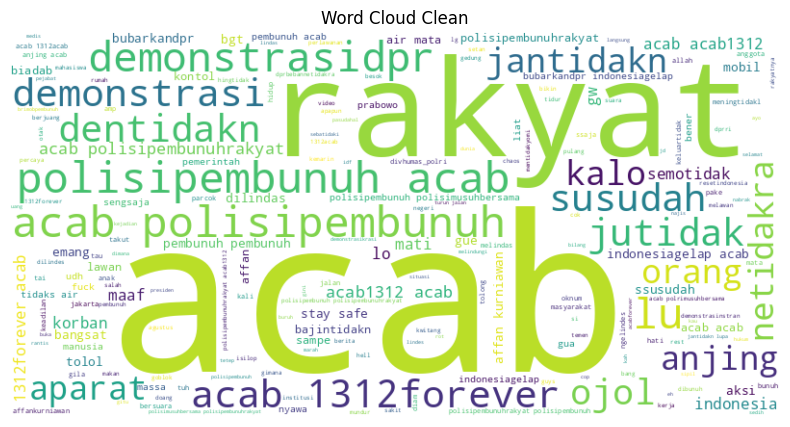
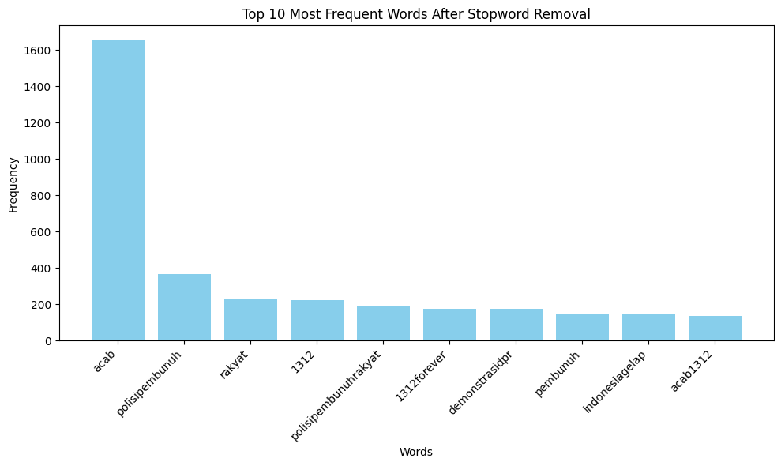
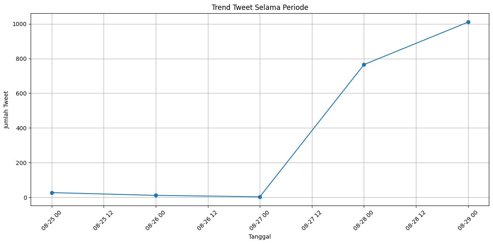
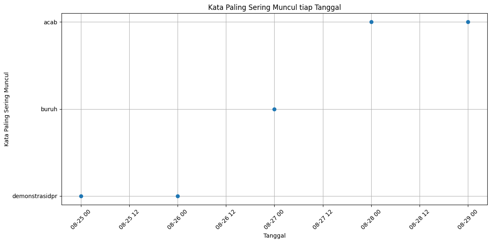

# 📊 Analisis Sentimen Publik pada Platform Twitter - Demonstrasi DPR RI Pada Periode Akhir Agustus 2025

## 📝 Deskripsi
Analisis ini dilakukan terhadap data percakapan di Twitter terkait **Demonstrasi DPR RI Pada Periode Akhir Agustus 2025**. Dataset berisi ribuan tweet dengan informasi seputar waktu, interaksi (retweet, like), serta isi teks.  
Tujuan utama dari analisis ini adalah untuk memahami **isu-isu yang berkembang**, **sentimen publik**, dan **tren yang tumbuh selama periode**.

---

## 📂 Dataset
Kolom dalam dataset:
- 🆔 `conversation_id_str` : ID percakapan Twitter
- ⏰ `created_at` : Waktu tweet dibuat
- ❤️ `favorite_count` : Jumlah likes
- 🔁 `retweet_count` : Jumlah retweet
- 💬 `reply_count` : Jumlah balasan
- ✍️ `full_text` : Isi teks tweet

Jumlah data: sekitar 1.821 baris (tweet).

---

## 🔍 Tahapan Analisis

1. **🧹 Preprocessing**  
   - Membersihkan data duplikat
   - Transformasi fitur pada kolom created_at  
   - Menghapus karakter non-alfabetik
   - Case Folding
   - Normalisasi kata tidak baku
   - Tokenisasi teks  
   - Stopword removal (bahasa Indonesia)  

2. **🗣️ Analisis Teks**  
   - Tokenisasi dan frekuensi kata
   - Analisis tren tweet  
   - Wordcloud kata paling sering muncul
   - Analisis sentimen menggunakan Lexicon Based (bahasa Indonesia)  
---

## 🚀 Hasil Utama

1. **🔥 Isu Utama**  
   - Banyak tweet terkait seruan aksi, kondisi lapangan, hingga kata-kata cacian secara eksplisit terhadap pemerintah.  
   - Kata kunci dominan: *demonstrasi*, *pembunuh*, *ojol*, *rakyat*, *aparat*, *acab*, *1213*. 

   📷 *Wordcloud kata dominan:*  
   

3. **🌍 Frekuensi Kata Terbanyak**  
   - Beberapa kata yang sering muncul dalam tweet.  

   📈 *Top Kata Dengan Muncul Tertinggi:*  
   

4. **⚖️ Sentimen Publik**  
   - Sentimen dominan negatif → banyak keluhan, protes, dan seruan perlawanan.  
   - Namun terdapat juga sentimen positif berupa seruan stay safe kepada demonstran dan narasi pemberitahuan.  

   📊 *Distribusi Sentimen Publik:*  
   

5. **📈 Tren Tweet**  
   - Pada periode 25-27 Agustus tren cenderung datar kemudian terjadi lonjakan tren signifikan pada periode 28-29 Agustus.  
   - Pada periode 25-26 Agustus frekuensi kata *demonstrasi dpr* sangat rendah kemudian terjadi lonjakan frekuensi kata *buruh* dan *acab* pada periode 27-29 Agustus.  

   📊 *Tren Tweet Secara Umum dan Berdasarkan Kata Kunci Dominan:*
    
   
---

## ✅ Kesimpulan
- Isu demo Agustus 2025 di Twitter didominasi oleh narasi **perlawanan terhadap pemerintah** dan **kecaman atas tindakan represif aparat**.  
- Sentimen publik lebih banyak ke arah **negatif**, mencerminkan ketidakpuasan.  
- Kata *Acab* menjadi sangat dominan dalam data, terjadi ketimpangan yang sangat kontras terhadap kata *demonstrasidpr*. Data ini mengindikasikan bahwa intensi publik yang sangat tinggi terhadap represifnya aparat kepolisian sampai-sampai hampir mendegradasi topik utama yakni demonstrasi tuntutan terhadap lembaga DPR RI.

---

## 💡 Rekomendasi
- Untuk penelitian lebih lanjut, bisa dilakukan **analisis temporal** (per hari/jam) untuk melihat dinamika isu.  
- Analisis **top hashtag** dan **topic modeling (LDA)** dapat memberikan gambaran lebih detail terkait framing isu.  
- Data ini dapat dipakai untuk **monitoring opini publik** serta **deteksi hoaks/propaganda**.

---

✍️ *Laporan ini dibuat untuk dokumentasi GitHub & Notion.*
