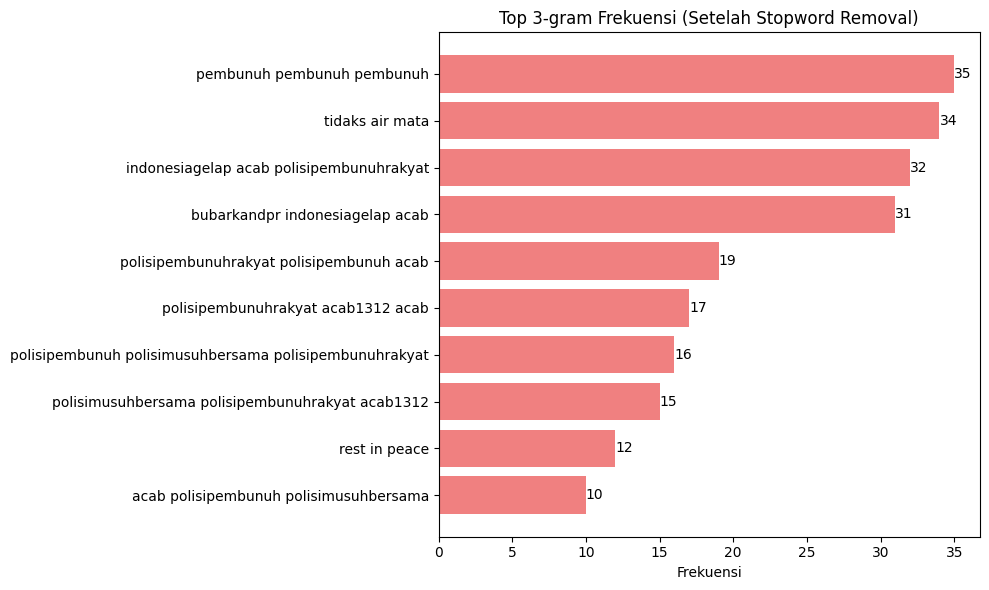

# Analisis Data Twitter - Demo Agustus 2025

## Deskripsi
Analisis ini dilakukan terhadap data percakapan di Twitter terkait **demo Agustus 2025**. Dataset berisi ribuan tweet dengan informasi seputar waktu, interaksi (retweet, like), serta isi teks.  
Tujuan utama dari analisis ini adalah untuk memahami **isu-isu yang berkembang**, **sentimen publik**, dan **jaringan percakapan**.

---

## Dataset
Kolom dalam dataset:
- `conversation_id_str` : ID percakapan Twitter
- `created_at` : Waktu tweet dibuat
- `favorite_count` : Jumlah likes
- `retweet_count` : Jumlah retweet
- `reply_count` : Jumlah balasan
- `full_text` : Isi teks tweet

Jumlah data: sekitar 1.821 baris (tweet).

---

## Tahapan Analisis

1. **Preprocessing**  
   - Membersihkan data duplikat
   - Transformasi fitur pada kolom created_at  
   - Menghapus karakter non-alfabetik
   - Case Folding
   - Normalisasi kata tidak baku
   - Tokenisasi teks  
   - Stopword removal (bahasa Indonesia)  

2. **Eksplorasi Awal**  
   - Distribusi waktu posting tweet  
   - Jumlah interaksi (likes, retweet, reply)  
   - Tweet dengan engagement tertinggi  

3. **Analisis Teks**  
   - Tokenisasi dan frekuensi kata
   - Analisis tren tweet  
   - Wordcloud kata paling sering muncul  
   - Analisis sentimen menggunakan Lexicon Based (bahasa Indonesia)  
---

## Hasil Utama

1. **Isu Utama**  
   - Banyak tweet terkait seruan aksi, kondisi lapangan, hingga kata-kata cacian secara eksplisit terhadap pemerintah.  
   - Kata kunci dominan: *demonstrasi*, *pembunuh*, *ojol*, *rakyat*, *aparat*, *acab*, *1213*. 

   📷 *Wordcloud kata dominan:*  
   

3. **Frekuensi Kata Terbanyak**  
   - Beberapa kata yang sering muncul dalam tweet.  

   📈 *Top kata dengan muncul tertinggi:*  
   

4. **Sentimen Publik**  
   - Sentimen dominan negatif → banyak keluhan, protes, dan seruan perlawanan.  
   - Namun terdapat juga sentimen positif berupa seruan stay safe kepada demonstran dan narasi pemberitahuan.  

   📊 *Distribusi sentimen publik:*  
   

---

## Kesimpulan
- Isu demo Agustus 2025 di Twitter didominasi oleh narasi **perlawanan terhadap pemerintah**.  
- Sentimen publik lebih banyak ke arah **negatif**, mencerminkan ketidakpuasan.  
- Jaringan percakapan menunjukkan **polaritas**: kubu pro-pemerintah vs kubu oposisi.  

---

## Rekomendasi
- Untuk penelitian lebih lanjut, bisa dilakukan **analisis temporal** (per hari/jam) untuk melihat dinamika isu.  
- Analisis **top hashtag** dan **topic modeling (LDA)** dapat memberikan gambaran lebih detail terkait framing isu.  
- Data ini dapat dipakai untuk **monitoring opini publik** serta **deteksi hoaks/propaganda**.

---

✍️ *Laporan ini dibuat untuk dokumentasi GitHub & Notion.*
